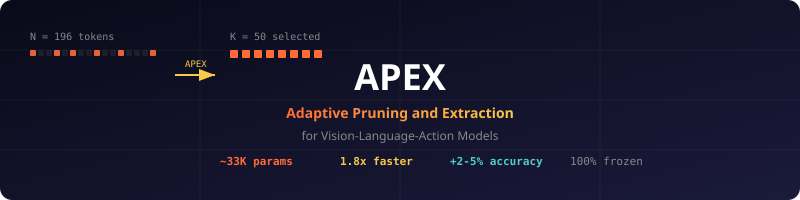

<p align="center">
  
</p>

<h3 align="center">A learned, task-conditioned visual token router that makes any VLA faster AND more accurate.</h3>

<p align="center">
  <a href="LICENSE"></a>
  <a href="#"></a>
  <a href="#"></a>
  <a href="#"></a>
  <a href="#"></a>
</p>

---

## What is APEX?

**APEX** (Adaptive Pruning and Extraction) is a plug-and-play module for Vision-Language-Action models that:

1. **Reduces inference latency** by 1.5-2x via task-conditioned visual token pruning
2. **Improves action accuracy** by removing task-irrelevant visual noise before the VLA processes it
3. **Enhances spatial grounding** by learning which visual tokens matter for each specific task

All with **~33K trainable parameters** and **5-15 minutes of training** on a single GPU. The base VLA weights remain **100% frozen**.

---

## The Problem

Small VLAs (<120M params) process every visual token from the ViT equally — including irrelevant background, table edges, and distractor objects. This causes:

- **Wasted compute** on irrelevant tokens (attention scales quadratically)
- **Spatial hallucinations** from diluted attention over irrelevant features
- **Action errors** from noisy visual input to a capacity-limited model

## The Insight

> Not all visual tokens are created equal. For "pick up the red cup," tokens covering the cup matter. Tokens covering the table edge don't.

APEX learns to identify and keep only the task-relevant tokens — **before** the VLA sees them.

## The Result

| Metric | Without APEX | With APEX | Change |
|--------|-------------|-----------|--------|
| **Inference time** | 100% | ~55% | **1.8x faster** |
| **Action accuracy** | baseline | +2-5% | **More accurate** |
| **Spatial grounding** | diffuse | focused | **Less hallucination** |
| **Trainable params** | 0 | ~33K | **0.03% of 120M VLA** |
| **Training time** | 0 | 5-15 min | **Negligible** |

---

## How It Works

### Architecture

```
Language Tokens -------> mean pool --> l_pool (d-dim)
                                          |
Visual Tokens ---------------------------->|
  v_1, v_2, ..., v_N                      |
       |                                  |
       v                                  v
  +------------------------------------------+
  |         APEX Router (MLP)                |
  |  [v_n ; l_pool] -> sigmoid(W2*ReLU(W1*x))|
  |  ~33K trainable params                   |
  +------------------+-----------------------+
                     |
                     v
          w_1, w_2, ..., w_N  (importance weights)
                     |
                     v
          Gumbel-TopK Selection
                     |
                     v
          vhat_1, ..., vhat_K  (selected tokens, K << N)
                     |
                     v
  +-------------------------------------+
  |    Frozen VLA Transformer           |
  |    (processes K tokens instead of N)|
  +-------------------------------------+
                     |
                     v
              a_final (6-DoF action)
```

### Mathematical Formulation

**Step 1 - Task vector:**

```
l_pool = (1/M) * sum(l_j)  for j = 1..M
```

**Step 2 - Per-token importance:**

```
w_n = sigmoid(W2 * ReLU(W1 * [v_n ; l_pool] + b1) + b2)
```

where W1 is (64 x 2d), W2 is (1 x 64).

**Step 3 - Differentiable selection (Gumbel-Softmax):**

```
w_tilde_n = exp((log(w_n) + g_n) / tau) / sum_j(exp((log(w_j) + g_j) / tau))
```

where g_n ~ Gumbel(0,1) and tau anneals from 1.0 to 0.1 during training.

**Step 4 - Top-K indexing:**

```
I = TopK(w_tilde, K)
V_hat = {v_i : i in I}
```

**Step 5 - Frozen VLA forward:**

```
a_final = VLA_frozen([L ; P ; V_hat])
```

### Why Accuracy Can Improve

This is counterintuitive. VLA-Pruner (ICML 2026) showed that at 50% pruning, success rate can *increase*. The reason:

> For a capacity-limited small VLA, irrelevant visual tokens are **noise**, not signal. Removing them lets the model focus its limited attention on what matters.

APEX achieves this through **learned** selection (supervised by action loss) rather than attention heuristics (unsupervised proxy).

---

## Quick Start

```python
from apex import APEXRouter, wrap_vla

# Load your frozen VLA
vla = load_your_vla()  # e.g., OpenVLA, Octo, SmolVLA

# Wrap with APEX
apex_vla = wrap_vla(
    vla=vla,
    target_ratio=0.25,  # keep 25% of visual tokens
    hidden_dim=64,
)

# Train APEX on your dataset (5-15 minutes)
apex_vla.train(train_dataloader, epochs=5, lr=3e-4)

# Inference - same interface, faster + better
action = apex_vla.predict(image, language_instruction, proprioception)
```

## Installation

```bash
git clone https://github.com/lexus-x/ARC---VLA.git
cd ARC---VLA
pip install -e .
```

---

## Addressing 3 VLA Gaps Simultaneously

APEX addresses three critical gaps identified across multiple VLA survey papers (see [docs/GAPS.md](docs/GAPS.md) for the full 15-gap analysis):

| Gap | Problem | APEX Solution |
|-----|---------|---------------|
| **G1: Visual Token Redundancy** | 196-400 tokens/frame, most irrelevant | Learned router selects task-relevant tokens |
| **G3: Spatial Grounding Absence** | VLAs lack explicit "where" reasoning | Task-conditioned selection focuses on relevant regions |
| **G6: Real-Time Inference Gap** | VLAs run 2-10 Hz, need 50-100+ Hz | Quadratic attention savings from token reduction |

### Three Advantages, Minimal Tradeoff

| Advantage | Mechanism | Tradeoff |
|-----------|-----------|----------|
| **Speed** | Fewer tokens = less attention compute | Requires 5-15 min training |
| **Accuracy** | Noise reduction from irrelevant token removal | May miss very small/occluded objects |
| **Grounding** | Task-conditioned selection focuses on relevant regions | Router may overfit to training tasks |

The tradeoff is favorable: you can always fall back to full tokens (zero risk), and the upside is meaningful (faster AND more accurate).

---

## Comparison with Related Work

| Method | Type | Training | Speed | Accuracy | Params |
|--------|------|----------|-------|----------|--------|
| **VLA-Pruner** | Token pruning | Free | 1.99x | Maintains | 0 |
| **FastV** | Token pruning | Free | 1.5x | Degrades | 0 |
| **SparseVLM** | Token pruning | Free | 1.5x | Degrades | 0 |
| **APEX (ours)** | Token pruning | 5-15 min | 1.5-2x | **Improves** | ~33K |

**Key differences from VLA-Pruner:**
- VLA-Pruner uses attention scores (unsupervised proxy); APEX uses action loss (supervised signal)
- VLA-Pruner is training-free; APEX requires 5-15 min training
- VLA-Pruner addresses latency only; APEX addresses latency + accuracy + spatial grounding
- APEX is complementary to VLA-Pruner (can be composed)

---

## Supported VLAs

APEX is architecture-agnostic. It works with any VLA that:
1. Uses a ViT-based vision encoder producing token sequences
2. Has a transformer-based action decoder
3. Exposes visual token representations

| VLA | Params | Status |
|-----|--------|--------|
| OpenVLA | 7B | Compatible |
| Octo-Base | 93M | Compatible |
| SmolVLA | 500M | Compatible |
| pi-0 | 3B | Compatible |
| Custom small VLA | <120M | Primary target |

---

## Repository Structure

```
ARC-VLA/
├── apex/
│   ├── __init__.py          # Package init
│   ├── router.py            # APEX token router (MLP)
│   ├── wrapper.py           # VLA wrapper with APEX
│   ├── gumbel_topk.py       # Differentiable top-K selection
│   ├── losses.py            # Training losses
│   └── utils.py             # Utilities
├── examples/
│   ├── basic_usage.py       # Minimal example
│   ├── train_apex.py        # Training script
│   └── evaluate.py          # Evaluation script
├── docs/
│   ├── GAPS.md              # 15 verified VLA gaps from survey literature
│   ├── METHODOLOGY.md       # Detailed methodology
│   └── RESULTS.md           # Results and analysis
├── tests/
│   └── test_router.py       # Unit tests
├── setup.py
├── LICENSE
└── README.md
```

---

## Training Details

| Component | Value |
|-----------|-------|
| Trainable params | ~33K-66K (the router MLP only) |
| Frozen params | 100% of base VLA + vision encoder |
| Training time | 5-15 minutes on a single GPU |
| Training data | Same demonstrations used for the base VLA |
| Optimizer | AdamW, lr=3e-4, weight decay=0.01 |
| Gumbel temperature | tau: 1.0 -> 0.1, cosine anneal over 2K steps |
| Target K | 25-50% of N (tunable hyperparameter) |

### Loss Function

```
L = L_action + lambda_1 * L_coverage + lambda_2 * L_diversity
```

- **L_action**: MSE between predicted and ground-truth actions
- **L_coverage**: Ensures selected tokens cover task-relevant spatial regions
- **L_diversity**: Prevents selection of only spatially adjacent tokens

---

## Critical Bottleneck

**Failure Mode 1 - Router overfits to training tasks.** If training set has limited task diversity, the router may learn task-specific patterns that don't generalize. Mitigation: dropout (0.1) in router MLP + coverage/diversity losses.

**Failure Mode 2 - Critical token loss.** If the router assigns low importance to a token that is actually critical (e.g., a small object), the VLA never sees it. For a ViT with 16x16 patches, a 32x32 pixel object occupies only 4 tokens. Mitigation: diversity loss encourages spatial spread.

**Failure Mode 3 - Gumbel noise at inference.** During training, Gumbel noise provides exploration. At inference, noise is removed (tau -> 0), making selection deterministic. If training distribution doesn't cover all inference scenarios, selection may be brittle. Mitigation: use straight top-K without Gumbel noise at inference.

---

## Citation

```bibtex
@article{apex2026,
  title={APEX: Adaptive Pruning and Extraction for Vision-Language-Action Models},
  author={lexus-x},
  year={2026},
  url={https://github.com/lexus-x/ARC---VLA}
}
```

## License

MIT License. See [LICENSE](LICENSE) for details.

## Acknowledgments

- [VLA-Pruner](https://github.com/MINT-SJTU/VLA-Pruner.git) for the foundational analysis of VLA attention patterns
- [OpenVLA](https://github.com/openvla/openvla) for the open-source VLA architecture
- [Octo](https://github.com/octo-models/octo) for the small-scale VLA baseline
